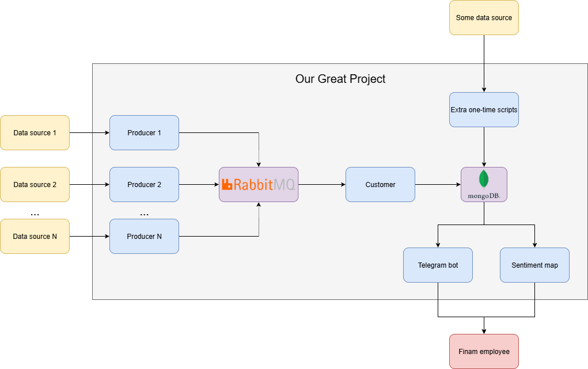

## Архитектура проекта:

- RabbitMQ и MongoDB работают в облаке
- Каждый продюсер работает со своим одним источником. Он берет из него данные и отправляет в RabbitMQ.
- Customer представлен в одном экземпляре. Он получает сырые данные из очереди, обрабатывает с помощью LLM и сохраняет в MongoDB.
- К MongoDB обращаются телеграм-бот и карта сантимента, чтобы отобразить данные.
## Producers
### Для 3 сервисов:
- [MarketTwits](https://t.me/markettwits)
- [TradingView](https://ru.tradingview.com/news-flow/?market=bond,economic,etf,forex,futures,index,stock&market_country=entire_world&provider=reuters,rbc) (Reuters и РБК)
- [Финмаркет](https://www.finmarket.ru/)
### Ссылка на Telegram-бота

