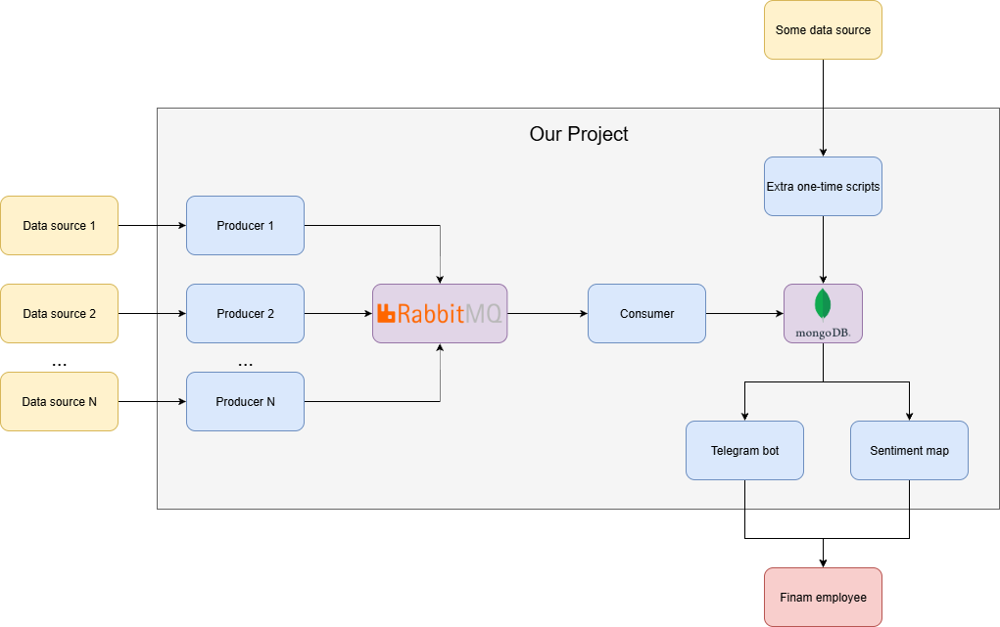

# Financial News Aggregator with Hotness and Sentiment Analysis
### Was developed in 2 days on Finam Hackathon 2025
## Project architecture:

- RabbitMQ and MongoDB storages run in a cloud.
- Each producer works with its own data source, collects data and sends it to RabbitMQ.
- Consumer accepts row data, processes it with ChatGPT and sends to MongoDB.
- Telegram Bot and Sentiment Map read from MongoDB to display data.
## Producers with realtime parsing:
- [MarketTwits](https://t.me/markettwits): big data collection, strict filtering, news hotness calculation based on number of message forwards
- [TradingView](https://ru.tradingview.com/news-flow/?market=bond,economic,etf,forex,futures,index,stock&market_country=entire_world&provider=reuters,rbc) (Reuters & RBC)
- [Finmarket](https://www.finmarket.ru/)
## Consumer — processing news with LLM:
- News hotness determination and filtering
- Sentiment analysis
- Financial post draft composition
- Short headline generation
- Companies, tickers, countries, sectors and currencies extraction
## Contributors:
- [Andrey Dementiev](https://github.com/andreydem0505): Project Architecture & Infrastructure, Team Leading, TradingView Parser, Telegram Bot, Sentiment Map
- [Nikita Filippov](https://github.com/Nikita-bite): MarketTwits & Finmarket Parsers
- [Nastya Kolle](https://github.com/nastya-kolle): AI Research, LLM Data Processing
- [Nikolai Konovalov](https://github.com/fhdudi47): News Clustering
